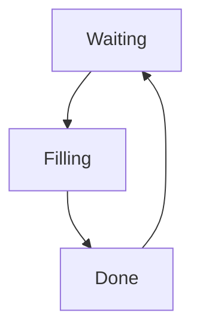

# Flux: A State Machine

[](https://gitlab.com/insha/Flux/commits/dev) [](https://gitlab.com/insha/Flux/commits/dev)

Flux is a lightweight library that provides an API for implementing a state machine in 
Python. It is a work-in-progress, but has some really cool features (see below) and unit tested.

State machines are a great way to manage complexity in your application and Flux provides 
you with an elegant API for implementing state machines in your project.

## Features
- Supports an arbitrary number of States and Events.
- States and Events support callbacks for responding to state transitions.
- Transitions support the inclusion of arbitrary user data, making it easy to broadcast metadata across callbacks.
- No dependencies for normal usage.

## Installation

From the cheese shop:

    pip install Flux

From source:

    pip install -e .

## Usage

A simple definition of a state machine is that any *machine* that has a set of *states* and *events* (also referred to as *transitions*) defined between them. The state machine pattern **enforces** only events that are allowed in the particular state can be triggered. However, this requires us to spend a bit of time upfront figuring out what are our states and which events can be triggered from these states.

Here, we are going to create a simple water bottle filling machine. There are three states, Waiting, Filling, Done. There are three events that lets us transition from one state to the next. A diagram of this state machine looks like:



We start by importing in the main components of Flux:

```python
from flux.machine import StateMachine
from flux.state import State, StateInfo
from flux.event import Event, EventCallback
from flux.errors import StateMachineError, StateMachineEventError, StateMachineStateError
```

```python
# Callbacks for states
def did_enter_state(transition):
    print(f'==> FSM::Did enter {transition.destination_state}')

def did_exit_state(transition):
    print(f'<== FSM::Did exit {transition.source_state}')

def will_enter_state(transition):
    print(f'--> FSM::Will enter {transition.destination_state} from {transition.source_state}')

def will_exit_state(transition):
    print(f'<-- FSM::Will exit {transition.source_state}')

# Callbacks for events
def did_fire_event(transition):
    print(f'=> FSM::Did fire {transition.event} in state {transition.source_state}')

def will_fire_event(transition):
    print(f'=> FSM::Will fire {transition.event} in state {transition.source_state}')

# State configuration
waiting = State(name='waiting', info=StateInfo(did_enter_state=did_enter_state, 
                                               did_exit_state=did_exit_state,
                                               will_enter_state=will_enter_state,
                                               will_exit_state=will_exit_state))

filling = State(name='filling', info=StateInfo(did_enter_state=did_enter_state, 
                                               did_exit_state=did_exit_state,
                                               will_enter_state=will_enter_state,
                                               will_exit_state=will_exit_state))

done    = State(name='done', info=StateInfo(did_enter_state=did_enter_state, 
                                            did_exit_state=did_exit_state,
                                            will_enter_state=will_enter_state,
                                            will_exit_state=will_exit_state))

# Event configuration
start_filling = Event(name='start_filling', info=EventInfo(source_states=[waiting], 
                                                           destination_state=filling,
                                                           will_fire_event=will_fire_event,
                                                           did_fire_event=did_fire_event))

bottle_full   = Event(name='bottle_full', info=EventInfo(source_states=[filling], 
                                                         destination_state=done,
                                                         will_fire_event=will_fire_event,
                                                         did_fire_event=did_fire_event))

remove_bottle = Event(name='remove_bottle', info=EventInfo(source_states=[done], 
                                                           destination_state=waiting,
                                                           will_fire_event=will_fire_event,
                                                           did_fire_event=did_fire_event))

# Let build and use our water bottle filling state machine!
try:
    fsm = StateMachine(states=[waiting, filling, done], 
                       events=[start_filling, bottle_full, remove_bottle], 
                       initial_state=waiting)
    
    print('Adding a bottle to fill.')
    fsm.activate()
    
    time.sleep(1.0)
    print('')
    fsm.fire_event(start_filling)
    time.sleep(1.0)
    print('')
    fsm.fire_event(bottle_full)
    print('')
    fsm.fire_event(remove_bottle)
    print('✨ 🍰 ✨')
except StateMachineEventError as e:
    print(e.message)
except StateMachineError as e:
    print(e.message)
```

## Running Tests

In order to run all of unit tests, you will need `pytest` and `pytest-cov` installed. These can be
installed using:

    pip install -r flux/requirements.txt

Once installed you can run all unit tests using:

    pytest --cov-report term-missing --cov=flux tests/

## Contributing

Please see the `CONTRIBUTING.md` file for more information.

## Code of Conduct

Our contributor code of conduct can be found in the `code-of-conduct.md` file.

## License

Flux is licensed under a three clause BSD License. It basically means: do whatever you want with it as long as the copyright in Salah sticks around, the conditions are not modified and the disclaimer is present. Furthermore you must not use the names of the authors to promote derivatives of the software without written consent.

The full license text can be found in the `LICENSE` file.